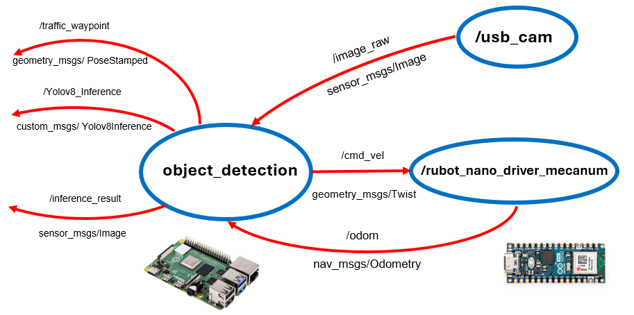
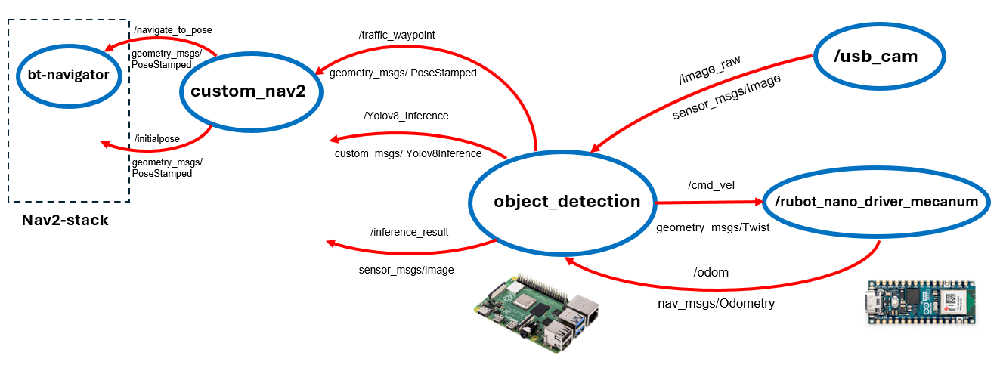

# Project for Traffic Signal Detection with YOLO

We will describe the Computer Vision based method to identify the Traffic Sign.

Training models: 
- https://roboflow.com/
- https://github.com/ultralytics/ultralytics
- https://docs.ultralytics.com/es/usage/python/#how-do-i-train-a-custom-yolo-model-using-my-dataset

For this project we have created a new package "my_robot_ai_identification" where we have used 2 strategies to perform signal identification:
- Keras with tensorflow
- YOLO 

## **1. ROS2 packages installation**

The needed Installation for YOLO identification is only to install "ultralytics" on the ROS2 Humble environment. Open a terminal and type:
````shell
pip install ultralytics
pip3 uninstall numpy
pip3 install "numpy<2.0"
````

## **2. Robot Navigation**

To proceed with the signal identification we first bringup the robot and navigate from initial pose to final target.

- Bringup the robot
    - In simulation:
    ````shell
    ros2 launch my_robot_bringup my_robot_bringup_sw.launch.xml use_sim_time:=true x0:=0.5 y0:=-1.5 yaw0:=1.57 robot:=rubot/rubot_mecanum.urdf custom_world:=square4m_sign.world
    ````
    >Important: Include a traffic signal in the world. When using "square4m_sign.world" you can change the sign model on line 30 changing the traffic sign model name
    - In real robot LIMO the bringup is already made when turned on

- Generate a map
    - In simulation:
        ````shell
        ros2 launch my_robot_cartographer cartographer.launch.py use_sim_time:=true
        ````
    - In real robot (rUBot or LIMO):
        ````shell
        ros2 launch my_robot_cartographer cartographer.launch.py use_sim_time:=false
        ````
- Save the map in my_robot_navigation2/map folder with:
    ````shell
    cd src/Navigation_Projects/my_robot_navigation2/map/
    ros2 run nav2_map_server map_saver_cli -f map_square4m_sign
    ````
- Navigate using the Map:
    - In simulation:
        ````bash
        ros2 launch my_robot_navigation2 navigation2_robot.launch.py use_sim_time:=true map_file:=map_square4m_sign.yaml params_file:=limo_sw.yaml
        ````
        >For LIMO: We use `limo_sw.yaml` file. In case we want to priorize the lidar data from odometry data we will use `limo_sw_lidar.yaml`. Equivalent names are found for rUBot real robot.

        
    - In the case of real robot:
        - Because the bringup is done without the LIMO robot model. The only frames available are
            - odom: as a ``base_frame_id``
            - base_link: as the ``robot_base_frame``
        - We have to create "LIMO_real.yaml" file in "param" folder correcting base_frame_id: "odom" (instead of base_footprint)
        ````shell
        ros2 launch my_robot_navigation2 navigation2_robot.launch.py use_sim_time:=false map_file:=map_square4m_sign.yaml params_file:=limo_real.yaml
        ````
        > Be sure the Odometry message is zero when starting the navigation.

## **3. Signal detection**

You can make a detection of the signal that the robot find on its path to target pose:
- for 1 test image (use ``picture_detection_yolo.py``). 
- for video images from robot camera when moving to target (use ``rubot_detection_yolo.py``)
- The schematic nodes, topics and messages are shown below:
    

**Software** test in Gazebo: 
- Use the ``rubot_detection_yolo.py`` after the navigation node is launched.
    ````shell
    ros2 run my_robot_ai_identification rubot_detection_yolo_exec
    ````
    > You have to verify the model path to '/home/user/ROS2_rUBot_mecanum_ws/src/AI_Projects/my_robot_ai_identification/models/yolov8n_custom.pt

    > Verify also the the camera topic if you are using rUBot or Limo

- To see the image with prediction:
    - on RVIZ2, select a new Image message on topic /inference_result
    
    
    - or use ``rqt_image_view`` in a new terminal
        ````shell
        rqt_image_view /inference_result
        ````

**Hardware** Test in real robot:
- If you want to execute on real `LIMO robot`, you have to install and execute on the Limo robot container:
    ````shell
    apt update
    apt install python3-pip
    pip install ultralytics
    # needed numpy version compatible
    pip3 uninstall numpy
    pip3 install "numpy<2.0"
    #
    apt install git
    git clone https://github.com/manelpuig/ROS2_rUBot_mecanum_ws.git
    source /opt/ros/humble/setup.bash
    apt install python3-colcon-common-extensions
    apt install build-essential
    colcon build
    source install/setup.bash
    ros2 run my_robot_ai_identification limo_rt_prediction_yolo_exec
    ````

- If you want to execute on real `rUBot robot`, you have to execute:
    ````shell
    ros2 launch my_robot_ai_identification rubot_detection_wp_yolo.launch.py
    ````
The main characteristics of this `object_detection` node are:
- It uses the YOLOv8 model previously trained to detect the traffic signs.
- Computes its distance from the robot using:
    - the depth image from the camera (if available)
    - or using the information of the traffic signal location in the map (`yolo_signals.yaml` file in `config` folder)
- Publishes the image wit the detected sign bounding box in the `/inference_result` topic
- Publishes a new waypoint in the `/traffic_waypoint` topic when a `left`or `right` sign is detected

You can see that this `object_detection` node is:
- usefull for  `stop`, `ceda` and `forbidden` signs, because the robot has to stop the movement
- NOT usefull for `turn right` and `turn left` signs, because the node publishes a new `waypoint` who is not able to be automatically integrated in the navigation2 stack.

We have to create a new `custom_nav2` node that can integrate the new waypoint in the navigation2 stack.

## **4. Custom Navigation with signal detection**

Considering the previous `object_detection` node, we have created a new `custom_nav2` node that:
- Reads the `initial_pose`, `waypoint` and `target_pose` from a YAML file
- Subscribes to `/traffic_waypoint` topic where the `object_detection` node publishes the waypoint when a sign is detected
- Calls the `BasicNavigator.goToPose()` method (that publishes to `/navigate_to_pose` topic) to go first to the waypoint (YOLO or YAML) and then to the target_pose.

    

To launch the robot Custom Navigation with signal detection, use:
- Launch the `object_detection` node with:
    ````shell
    ros2 launch my_robot_ai_identification rubot_detection_wp_yolo.launch.py topic:=/image_raw front_distance:=0.3 Izquierda:=[1.80, 0.0]
    ````
- Launch the `custom_nav2` node with:
    ````shell
    ros2 launch my_robot_nav_control rubot_nav2_wp_yolo.launch.py target_pose:=[8.0, -0.5, 1.57]
    ````
- use ``rqt_image_view`` in a new terminal
    ````shell
    rqt_image_view /inference_result
    ````
